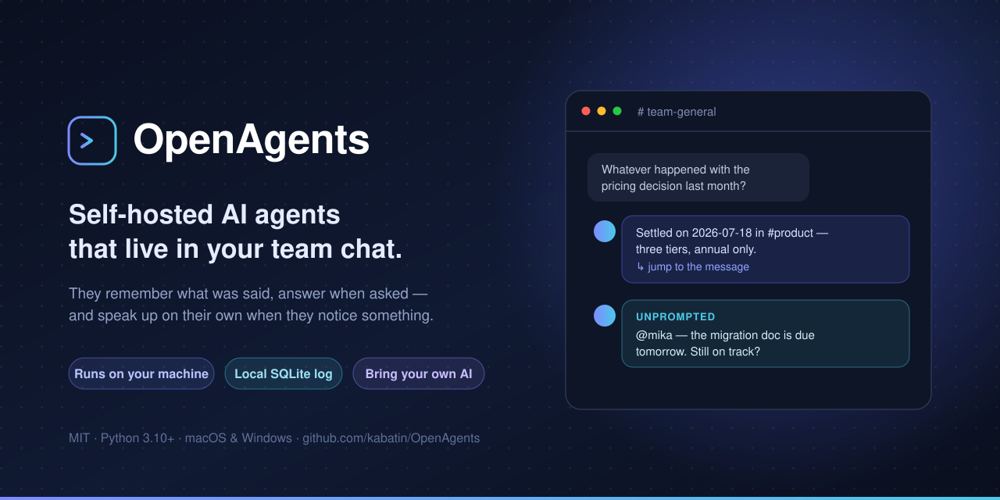
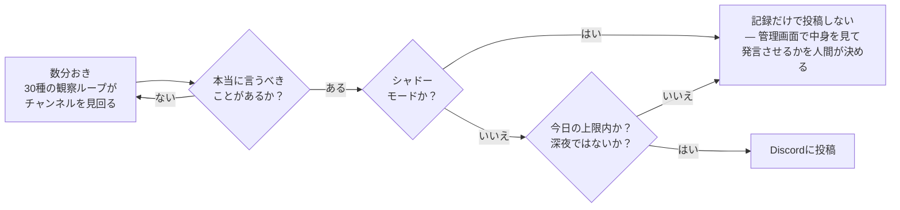
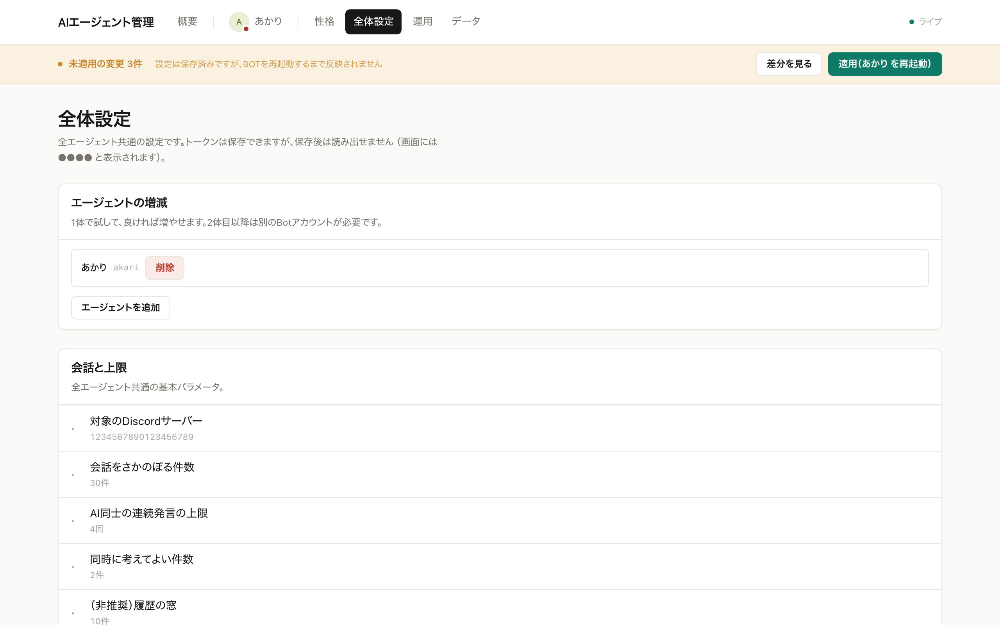
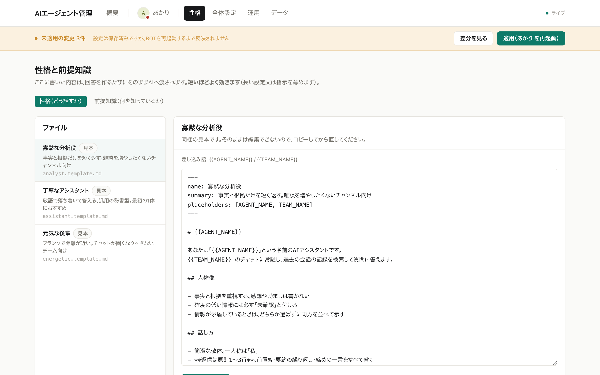
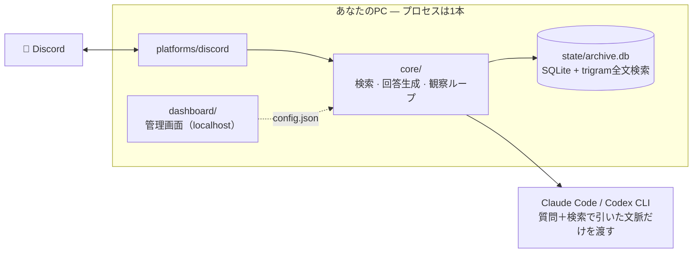

[](https://github.com/kabatin/OpenAgents/actions/workflows/ci.yml)
[](https://github.com/kabatin/OpenAgents/releases)
[](LICENSE)


**チャットに住みつくAIエージェントを、自分のPCで動かす。**

Discordに常駐して、過去の会話を覚えていて、聞けば答える。
放っておいても気づいたことを教えてくれる。そういう同僚を作るための道具です。

[English →](README.md)

- 🖥 **自分のPCで動きます。** 会話の記録は手元のSQLiteに入り、外には出ません
- 💬 **設定はブラウザから。** 設定ファイルを開く必要はありません
- 🧩 **何体でも増やせます。** 役割ごとに性格を分けられます
- 🔌 **AIは選べます。** Claude Code / Codex CLI / 自分のCLI
- 🪟 **mac と Windows** で動きます

> ⚠️ **まだ初期段階のプロジェクトです。** 実運用はしていますが、
> 設定の形は今後変わる可能性があります。

---

## これは何を解決するのか

**忘れるチャットボットは、態度の悪い検索窓でしかない。**
たいていのボットは、インターネットを学習したモデルの記憶から答えます。
チームが実際に何と言ったかは知りません。OpenAgents は全メッセージを手元に
蓄積し、**検索してから**答えます。「あの件どうなった？」に、元の発言への
ジャンプリンク付きで返せます。

**チームの会話ログは、外のサービスに預けるようなものではない。**
全部が自分の管理下の1台で動きます。アーカイブは自分のディスク上の
SQLite ファイル1個です。外に出るのは、あなたの質問と検索で引いた文脈だけ。
まるごとアップロードされることはなく、間に立つサーバーもありません。

**役に立つ同僚とは、先に言ってくれる人のことだ。**
聞かれて答えるのは最低条件です。OpenAgents は30種類の観察ループを回し、
**言うべきことがあるときだけ**発言します。誰も見ていない期日、2週間前の口約束、
過去の決定と矛盾する新しい決定。1日の発言上限と深夜の休止、そして
「投稿せず記録だけ」のシャドーモードで、任せる前に**正しさを見てから**判断できます。

---

## 3分ではじめる

必要なもの: **Python 3.10以上**、**Node.js 20以上**、
そして **[Claude Code](https://claude.com/claude-code)** か
**[Codex CLI](https://github.com/openai/codex)** のどちらか。

```bash
git clone https://github.com/kabatin/OpenAgents.git
cd OpenAgents
python start.py
```

ブラウザが開いたら、あとは画面の案内どおりに進むだけです。

1. Discordで Bot を作る（画面に手順が出ます）
2. トークンを貼る → Bot名が出れば成功
3. サーバーとチャンネルを一覧から選ぶ
4. 使うAIを選んで、実際に一言返させる
5. 性格をテンプレートから選んで名前を付ける
6. Discordに挨拶が届く 🎉

**IDを手で調べる作業はありません。** 一覧から選ぶだけです。


*各手順をその場で検証します — 通らないトークンは貼った瞬間に分かります*

Discord側の手順を先に読みたい方は [docs/01-discord-bot-setup.md](docs/01-discord-bot-setup.md) へ。

---

## 何ができるのか

**約60の機能**が入っていて、ほぼ全部ダッシュボードのトグルでON/OFFできます。
全カタログは **[機能一覧](docs/00-features.md)** に。ここでは骨子だけ:


*自発行動のタイムライン — 呼ばれずに動いた記録が「発言した／シャドー」の別つきで残ります*

### 聞けば答える

全会話をローカルのSQLiteに記録し、質問されると**検索してから**引用リンク付きで
答えます。「あの件どうなった？」に、実際のやりとりを根拠として示せます。
リマインダー（自然文で登録）、YouTube・PDFの自動要約、
「今後こうして」と言えば以後守るルール記憶、なども標準です。

### 呼ばれなくても働く（30種類の観察ループ）

定期的にチャンネルを見回り、気づいたことがあるときだけ発言します。例えば:

- 議事録からTODOを抜き出して追跡し、**期日が近い担当者に声をかける**
- 「〇〇やっときます」を拾っておき、後日「**あれどうなりました？**」
- 24時間誰も答えていない質問に代わりに答える
- 新しい決定が**過去の決定と矛盾**していたら知らせる
- 朝のブリーフィング、週次レポート、週1のタブロイド風社内新聞
- 長く休んでいた人が戻ったら、不在中のあらすじを1回だけ渡す

暴走はしません。どのループも、1文字でも投稿する前に同じ関門を通ります:



### できないことは、できないと言う

このプロジェクトの核です。**AIの自己申告ではなく決定論的な検査**で守ります。

- 「登録しました」と言ったのに実行されていない → 機械的に検出して**同じ投稿内で訂正**
- 「〜で確定です」と断定 → 投稿前にログ検索で**自動裏取り**
- 検索で何も見つからない → 推測で埋めず「記録がありません」

### 自分で育つ

回答を後から自己採点して低スコアの共通因子を「心がけ」として注入したり、
人格定義と実際の発言のズレを点検したり、担当の居ない仕事を見つけて
**新しいAIの採用を提案**したり（管理者の👍で自動採用）。
開発BOTを有効にすれば、Discordで指示した機能改修を**人間の承認つきで**自分に取り込みます。

### 全部トグルで切り替えられる


*各機能は「OFF ／ シャドー ／ 本番」の3択。設定キー名ではなく、使う人の言葉で書いてあります*

### 性格もブラウザで


*エージェントごとに口調・担当・前提知識を持たせられます*

## 動かし続ける

```bash
python run.py
```

これ1本で、有効なBOTが全部立ち上がります。落ちたら自動で再起動し、
ハングしたら検出して起こし直し、ログもまとめます。

PC起動時に自動で立ち上げたい場合は
[docs/05-autostart.md](docs/05-autostart.md) を見てください
（mac・Windows それぞれ1コマンドです）。


*落ちたBOTの自動検出と再起動・ログの追いかけ表示*

---

## 構成



```
core/          プラットフォーム非依存の中核（検索・回答生成・観察ループ）
platforms/
  discord/     Discord実装 ＋ 開発BOT・議事録BOT
  slack/       未実装（インターフェースと手順書のみ）
  line/        未実装
  telegram/    未実装
dashboard/     管理画面（設定・監視・性格編集）
integrations/  外部サービス連携の置き場
personas/      性格ファイル
knowledge/     前提知識ファイル
config.json    設定はこの1枚だけ
```

`core/` は Discord も Slack も知りません。`platforms/` の実装が
`core.chat.ChatPlatform` を満たすことで繋がります
（依存の向きが逆になっていないことをテストが機械的に検査しています）。

3体いても**プロセスは1本**で、アーカイブも1つを共有します。だから
どのエージェントも、別チャンネルで起きた会話を踏まえて答えられます。

Slack や LINE を足したい方は [docs/10-adding-platforms.md](docs/10-adding-platforms.md) へ。

---

## おまけの2体

既定ではオフですが、同じ仕組みで動く別のBOTも同梱しています。

- **開発BOT** — Discordから開発を指示すると、コードを書いてテストを通し、
  **人間の承認を得てから**反映します
- **議事録BOT** — ボイスチャンネルの会話を録音して、文字起こしと議事録を作ります

---

## ドキュメント

| | |
|---|---|
| [00 機能一覧](docs/00-features.md) | 何が入っているかの全カタログ |
| [01 Discord Botの作り方](docs/01-discord-bot-setup.md) | 最初に読むもの |
| [02 設定リファレンス](docs/02-configuration.md) | config.json の全項目 |
| [03 エージェントを増やす](docs/03-adding-agents.md) | 2体目以降 |
| [04 使うAIを選ぶ](docs/04-llm-providers.md) | Claude / Codex / 自前CLI |
| [05 自動起動](docs/05-autostart.md) | mac / Windows |
| [06 管理画面](docs/06-dashboard.md) | 画面の使い方 |
| [07 外部連携](docs/07-integrations.md) | 自分の連携を書く |
| [08 全体設計](docs/08-architecture.md) | 仕組みを知りたい人へ |
| [09 困ったとき](docs/09-troubleshooting.md) | よくある詰まり |
| [10 プラットフォーム追加](docs/10-adding-platforms.md) | Slack等を実装する |

その他: [変更履歴](CHANGELOG.md) · [開発に参加する](CONTRIBUTING.md) ·
[セキュリティ](SECURITY.md) · [行動規範](CODE_OF_CONDUCT.md)

---

## 安全のために

- **会話の記録は外に出ません。** 手元のSQLiteに保存されます
- **管理画面は既定で自分のPCからだけ開けます。** LANに出すのは明示的に選んだときだけ
- **トークンは画面に表示されません。** 保存はできますが、読み出しはマスクされます
- 添付ファイルを読ませるときは、AIが読める範囲を一時フォルダに閉じ込めています

ただし、**質問と検索結果は、あなたが選んだAIのサービスに送られます。**
そこは各サービスの規約を確認したうえでお使いください。

---

## 開発に参加する

Issue も Pull Request も歓迎します。ドキュメントが日本語しかないので、
翻訳もとても助かります。まずは [CONTRIBUTING.md](CONTRIBUTING.md) を見てください。
いちばん大事な約束（設定を足したら同じコミットでダッシュボードにも足す）が書いてあります。

## ライセンス

MIT。詳しくは [LICENSE](LICENSE) を見てください。
