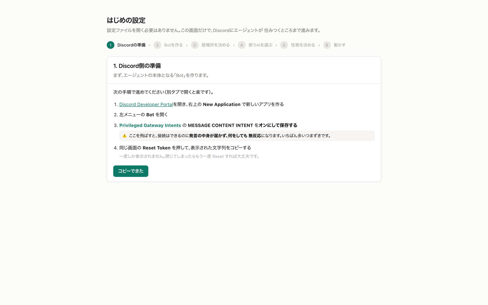
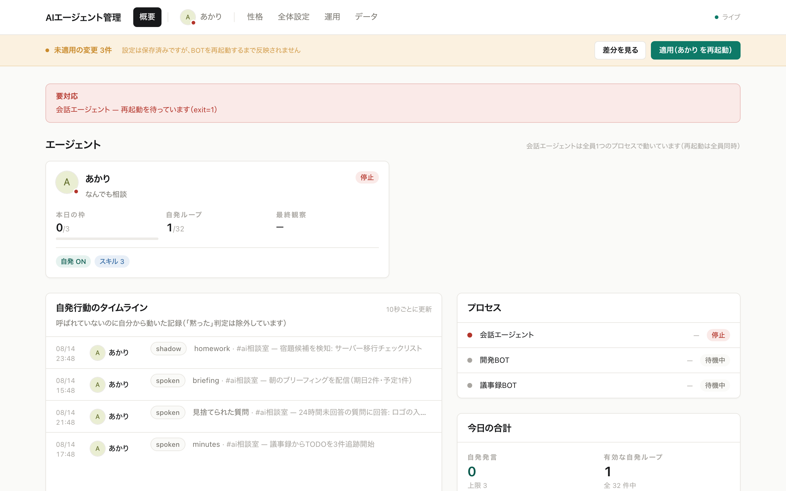
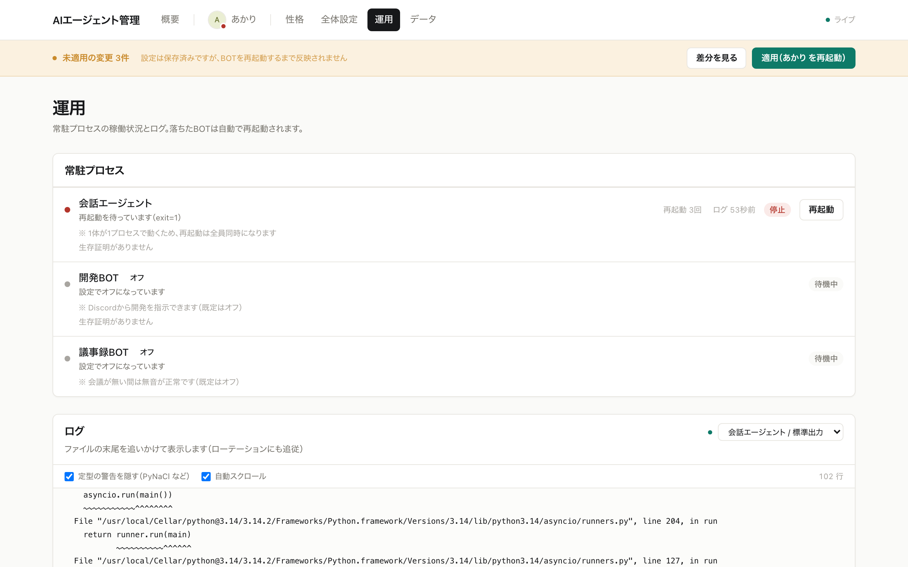

# OpenAgents

[](https://github.com/kabatin/OpenAgents/actions/workflows/ci.yml)
[](https://github.com/kabatin/OpenAgents/releases)
[](LICENSE)


**Self-hosted AI agents that live in your team chat.**

They sit in your Discord, remember what was said, answer when asked — and
occasionally speak up on their own when they notice something.

[日本語版はこちら →](README.ja.md)

- 🖥 **Runs on your machine.** Conversation history stays in a local SQLite file
- 💬 **Set up in a browser.** You never have to open a config file
- 🧩 **Add as many agents as you like**, each with its own personality
- 🔌 **Bring your own AI.** Claude Code, Codex CLI, or any CLI you have
- 🪟 **macOS and Windows**

> ⚠️ **Early-stage project.** It runs in production for its author, but the
> configuration format may still change.

---

## Quick start

You need **Python 3.10+**, **Node.js 20+**, and either
**[Claude Code](https://claude.com/claude-code)** or
**[Codex CLI](https://github.com/openai/codex)**.

```bash
git clone https://github.com/kabatin/OpenAgents.git
cd OpenAgents
python start.py
```

A browser opens and walks you through the rest:

1. Create a Discord bot (the steps are shown on screen)
2. Paste the token — the bot's name appears if it worked
3. Pick your server and channel **from a list**
4. Choose your AI and have it reply once, to prove it works
5. Pick a personality template and name your agent
6. Your agent says hello in Discord 🎉

**No IDs to look up by hand.** Everything is a dropdown.



---

## What it does

There are **~60 features**, almost all toggleable from the dashboard.
The full catalogue is in **[docs/00-features.md](docs/00-features.md)** (Japanese).
The essentials:



**Answers from real history.** Every message is archived locally; when someone
asks "what happened with that?", the agent searches the log and answers with
citation links. Reminders in natural language, YouTube/PDF auto-summaries, and
"from now on, do it this way" rule memory are all built in.

**Works unprompted — 30 observation loops.** It periodically scans channels and
speaks only when it has something: extracting action items from meeting minutes
and **nudging owners before deadlines**, remembering "I'll do it later"
promises and following up, answering questions nobody answered for 24h,
flagging decisions that **contradict earlier ones**, morning briefings, weekly
reports, even a tabloid-style weekly newspaper. It won't spam you: there's a
**daily cap on unprompted messages**, it sleeps at night, and every behaviour
can run in *shadow mode* (recorded, not posted) first.

**Admits failure — mechanically.** If the agent claims it did something that
didn't actually run, that's detected deterministically and **corrected in the
same message**. Confident assertions are fact-checked against the archive
before posting. Empty search results produce "no records found", not guesses.

**Improves itself.** It grades its own answers and distils the failures into
standing guidance, audits the gap between its persona and its actual
behaviour, proposes hiring a new agent when it finds unowned work (one 👍 from
an admin auto-creates it), and — with the dev bot enabled — ships code changes
to itself **only after human approval**.

## Keeping it running

```bash
python run.py
```

One process supervises every enabled bot: restarts on crash with backoff,
detects hangs via heartbeats, and rotates logs. To start it at login, see
[docs/05-autostart.md](docs/05-autostart.md) — one command on either OS.



---

## Layout

```
core/          Platform-independent: search, generation, observation loops
platforms/
  discord/     Discord implementation (+ dev bot, meeting bot)
  slack/       Not implemented — interface and notes only
  line/        Not implemented
  telegram/    Not implemented
dashboard/     Web UI: setup, settings, monitoring, persona editing
integrations/  Your own external-service connectors
config.json    The only config file
```

`core/` knows nothing about Discord. Platform code satisfies
`core.chat.ChatPlatform`, and a test enforces that the dependency never points
the other way. To add Slack or another platform, see
[docs/10-adding-platforms.md](docs/10-adding-platforms.md).

---

## Also included (off by default)

- **Dev bot** — take development requests in Discord, write the code, run the
  tests, and ship it **only after a human approves**
- **Meeting bot** — record a voice channel, transcribe it, and write the minutes

---

## Docs

Documentation is written in Japanese, since that is the author's working
language. Contributions translating it are very welcome.

| | |
|---|---|
| [00](docs/00-features.md) | Full feature catalogue |
| [01](docs/01-discord-bot-setup.md) | Creating the Discord bot — **start here** |
| [02](docs/02-configuration.md) | Configuration reference |
| [03](docs/03-adding-agents.md) | Adding more agents |
| [04](docs/04-llm-providers.md) | Choosing your AI |
| [05](docs/05-autostart.md) | Starting at login |
| [06](docs/06-dashboard.md) | Using the dashboard |
| [07](docs/07-integrations.md) | Writing an integration |
| [08](docs/08-architecture.md) | How it works |
| [09](docs/09-troubleshooting.md) | When things break |
| [10](docs/10-adding-platforms.md) | Adding Slack, LINE, Telegram… |

---

## Privacy and safety

- **Your conversation history never leaves your machine** — it lives in a local
  SQLite file
- **The dashboard binds to localhost by default.** Exposing it to your LAN is an
  explicit opt-in, and it warns you if you do that without a password
- **Tokens are write-only in the UI.** You can save them; you cannot read them back
- When reading attachments, the AI's file access is confined to a temp directory

That said, **your questions and the retrieved context are sent to whichever AI
provider you choose.** Check that provider's terms before using this with
sensitive material.

---

## License

MIT — see [LICENSE](LICENSE).
