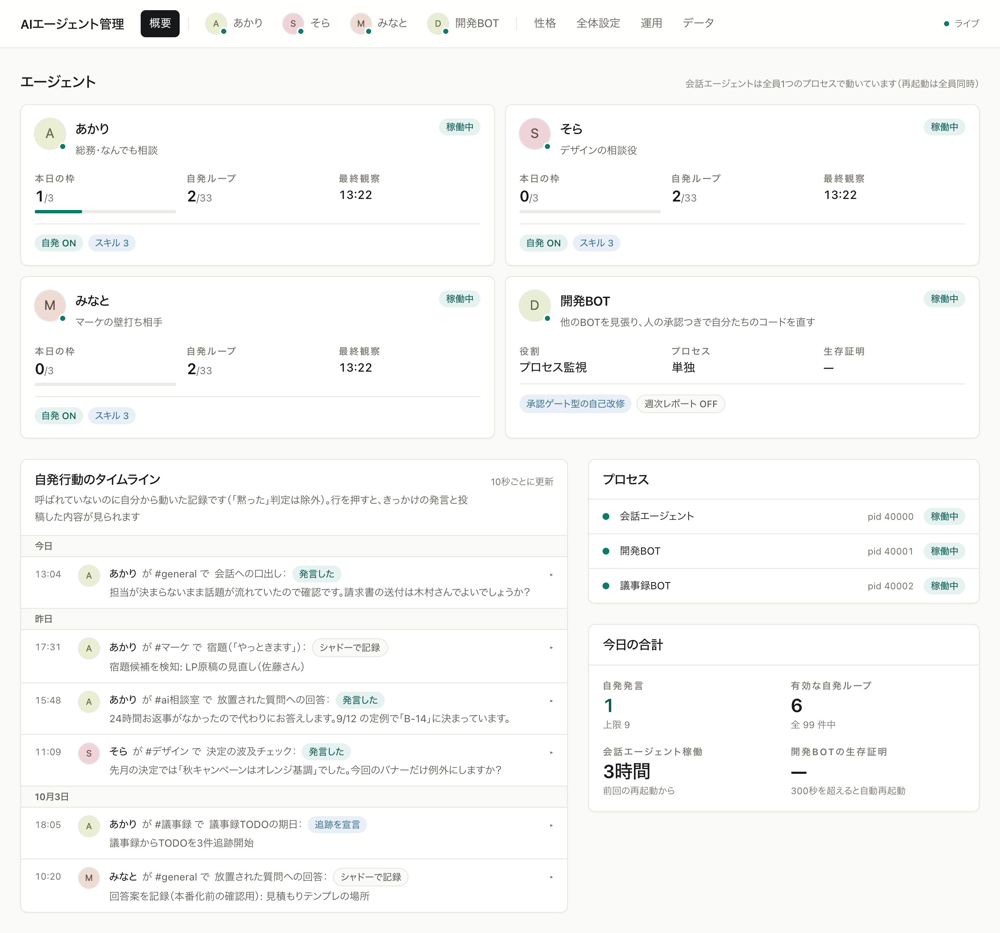
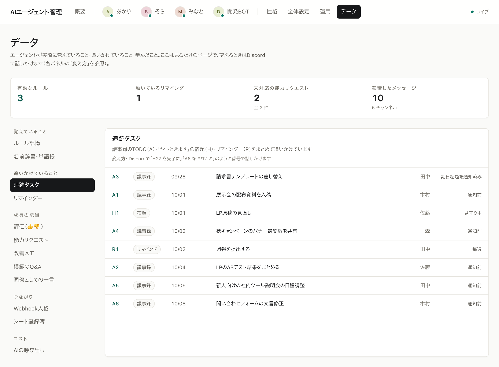

# 管理画面

エージェントの設定・状態・性格をブラウザから扱う画面です。

```bash
python start.py     # これで起動してブラウザが開く
```

`start.py` はダッシュボードと常駐プロセス（`run.py`）の両方を立ち上げます。
初回は自動でセットアップウィザードが開き、2回目以降は通常の管理画面になります。

## 画面の構成

| 画面 | できること |
|---|---|
| 概要 | 各エージェントの状態・今日の自発発言の残り枠・自発行動のタイムライン・プロセスの状態 |
| エージェント | 1体ごとの設定。「よく使う設定／自分から動く機能／スキル／すべての設定」のタブと絞り込み検索 |
| 性格 | 性格ファイルと前提知識の編集（保存すれば次の回答から反映・再起動不要） |
| 全体設定 | エージェントの増減・使うAI・会話と上限・外部連携・開発BOT・議事録BOT・この管理画面・秘密情報と初期化 |
| 運用 | 常駐プロセスの稼働状況と再起動・機能ごとの最終実行・ログ閲覧 |
| データ | 覚えていること・追いかけていること・成長の記録・つながり・コスト |
| 開発BOT | 👍待ちの提案・起票ロードマップ・開発ジョブ・反映履歴（開発BOTを有効にしたときだけ出ます） |



### 概要

自発行動のタイムラインには、どのエージェントが・どのチャンネルで・何の機能で
動いたかと、きっかけになった発言・投稿の冒頭が並びます。行を押すと全文と
Discordへのリンクが開きます。「黙った」判定は除いています。

### エージェント

設定が多いので、まず「よく使う設定」だけを見せます。自分から動く機能は
目的別の小見出しで並び、各行は名前の下に1行の説明、右に現在値が出ます。
既定値から変えたものだけに「変更済み」が付きます。

投稿を伴う機能は「OFF／シャドー／本番」の3択です。シャドーは判定と記録だけを行い、
投稿はしません。管理画面で中身を確かめてから本番にしてください。

### データ

左のナビから見たいものを選びます。`/data#tasks` のように URL で直接開けます。
各パネルの冒頭に「これは何か」と「変え方（Discordで何と話しかけるか）」が
書いてあります。この画面は閲覧専用で、変更はDiscordでの会話から行います。

| 見出し | 中身 |
|---|---|
| 覚えていること | ルール記憶・名前辞書・単語帳 |
| 追いかけていること | 追跡タスク（議事録TODO・宿題・リマインダーを A6 / H27 / R57 の形で一覧）・リマインダー・裏の作業（引き受けた重い作業と、結果の本文・失敗の理由） |
| 成長の記録 | 👍👎の評価・能力リクエスト・失敗と間違い（❌された提案と教わった理由・自動ではやり切れなかったこと・点検で赤。起票済みなら起票番号つき）・改善メモ・模範のQ&A・同僚としての一言 |
| つながり | Webhook人格・シート登録簿 |
| コスト | AIの呼び出し（日別・用途別・直近。失敗は理由つき） |



## 設定の反映

設定は**保存した瞬間には反映されません**（BOTは起動時に設定を読むため）。
保存すると行の右に「保存しました」と出て、画面上部に「未適用の変更」バーが出ます。
**「適用（〜を再起動）」**を押し、確認でもう一度押すと再起動します（Esc で取り消せます）。
性格ファイルの編集だけは例外で、再起動なしで次の回答から効きます。

## 公開範囲

**既定では自分のPCからだけ開けます**（`127.0.0.1:8787`）。

同じLANの他の端末（スマホなど）から使いたい場合は、
「全体設定」→「この管理画面」で公開範囲を変えます。ただし:

- **パスワードの設定が必須です。** パスワード無しでLANに公開する設定のまま
  起動しようとすると、**起動を拒否します**（この画面はBotトークンの保存・
  設定変更・Discordへの投稿・BOTの再起動ができるためです）
- **インターネットには公開しないでください。** 外から使いたい場合は
  Tailscale などのVPNを使ってください

## 仕組み（触る人向け）

```
dashboard/
  server/          Hono のAPIサーバー（Botトークンを読める側）
    config/        config.json の読み書き（検証・バックアップ・直列化）
    ops/           稼働状況（スーパーバイザへの問い合わせ）・ログ
    setup/         セットアップウィザードの裏方（Discord API・LLM検出）
  web/             React の画面（トークンは一切受け取らない）
```

### 守られていること

- **設定の書き込みは `server/config/store.ts` の1箇所だけ。** すべての
  書き込みは直列化され、tmp+rename でアトミックに置き換わります
- **秘密は「書けるが読めない」。** トークンは保存できますが、読み出しは
  必ずマスクされます（`views.ts` の責務）
- **状態を変えるAPIはすべて POST 系。** CSRF検査（Origin / Sec-Fetch-Site）を
  通らないリクエストは拒否されます
- **`config.json` に素の `JSON.parse` は使いません。** 19桁のIDが丸まって
  壊れるため、必ず `bigjson.ts` を通します
- 会話のDB（`state/archive.db`）は**読み取り専用**で開きます。
  画面から会話の記録を書き換えることはできません

### BOTの操作

BOTの起動・再起動は、ダッシュボードが直接行うのではなく、
常駐プロセス（`run.py`）の操作API（`127.0.0.1:8788`）へ依頼します。
`run.py` が動いていないと「常駐プロセスに接続できません」と表示されます —
その場合はターミナルで `python run.py` を起動してください。

### 検証

```bash
cd dashboard && npm test && npm run typecheck
```

BOT側に設定を足したら、`server/config/catalog.*.ts` にも1件足してください
（詳しくは [CONTRIBUTING.md](../CONTRIBUTING.md)）。
